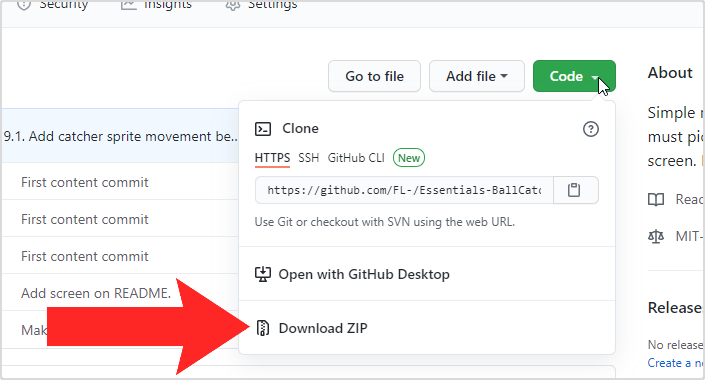
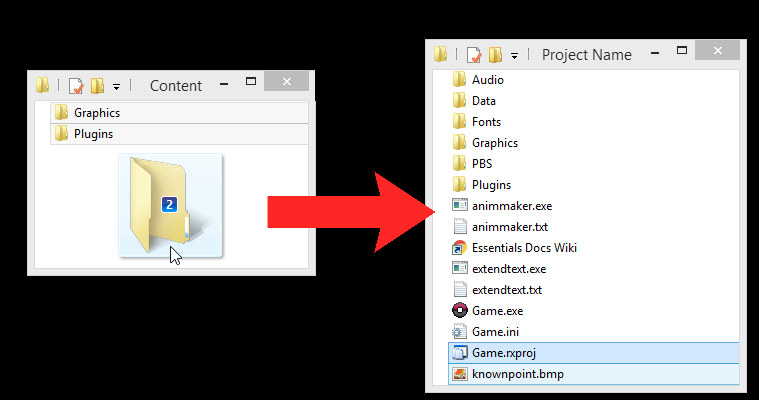

# How to install an Essentials plugin
On plugin repository/page, download the plugin as a zip.

Move the content of "Content" folder into your project folder.

Run your game from RPG Maker XP Playtest/Debug Mode while holding CTRL to compile the plugin.